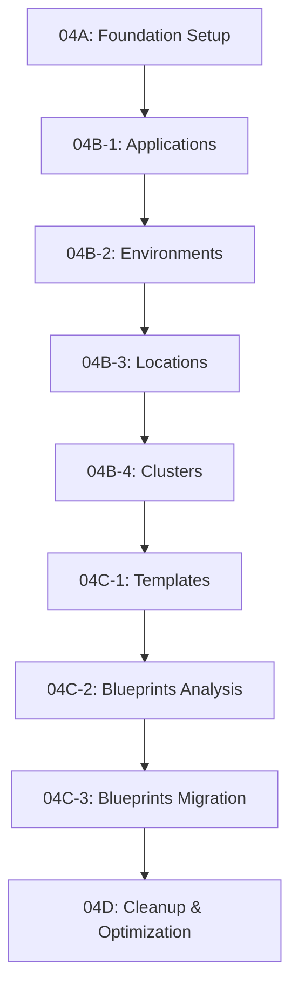

# Phase 04: Features Architecture Migration - Index

**Objetivo Geral**: Migrar DataOcean Instance Manager para features architecture híbrida seguindo architecture-standards.md.

## Sub-phases Overview

### 🏗️ **Foundation Phase**

- **[Phase 04A: Foundation Setup](./phase-04a-foundation-setup.md)**
  - Criar estrutura base `src/features/`
  - Configurar tooling e validação
  - Preparar templates de features

### 🔧 **Foundation Domains Migration**

- **[Phase 04B-1: Applications Migration](./phase-04b1-applications-migration.md)**

  - Migrar domain Applications para features architecture
  - Primeiro exemplo de migração completa

- **[Phase 04B-2: Environments Migration](./phase-04b2-environments-migration.md)**

  - Migrar domain Environments
  - Aplicar padrões definidos em 04B-1

- **[Phase 04B-3: Locations Migration](./phase-04b3-locations-migration.md)**

  - Migrar domain Locations
  - Consolidar padrões de migração

- **[Phase 04B-4: Clusters Migration](./phase-04b4-clusters-migration.md)**
  - Migrar domain Clusters
  - Finalizar Foundation Domains

### 🎭 **Orchestration Domains Migration**

- **[Phase 04C-1: Templates Migration](./phase-04c1-templates-migration.md)**

  - Migrar domain Templates
  - Lidar com complexidade de Template Pattern

- **[Phase 04C-2: Blueprints Analysis](./phase-04c2-blueprints-analysis.md)**

  - **CRÍTICO**: Analisar duas implementações Blueprint
  - Definir estratégia de consolidação
  - Tomar decisão arquitetural

- **[Phase 04C-3: Blueprints Migration](./phase-04c3-blueprints-migration.md)**
  - Migrar Blueprints baseado na análise de 04C-2
  - Consolidar implementações
  - Finalizar Orchestration Domains

### 🧹 **Cleanup & Optimization**

- **[Phase 04D: Cleanup & Optimization](./phase-04d-cleanup-optimization.md)**
  - Cleanup final de legacy code
  - Otimização de imports
  - Validação completa do sistema

## Execution Order

**SEQUENCIAL**: As phases devem ser executadas em ordem devido às dependências:



## Dependencies & Pre-conditions

### **Before Starting Phase 04**

- ✅ Phase 00: Code Cleanup completa
- ✅ Phase 01: Foundation completa
- ✅ Phase 02: Testing Setup completa
- ✅ Phase 03: API Layer completa

### **Critical Decision Point**

- **Phase 04C-2** é um ponto de decisão crítico
- Definirá a arquitetura final de Blueprints
- Impacta a implementação de 04C-3

## Key Patterns & Standards

### **Features Structure Pattern**

```typescript
src/features/[domain]/
├── index.ts                 // Public API
├── components/             // UI Components
│   ├── index.ts
│   └── __tests__/
├── hooks/                  // Feature-specific hooks
│   ├── index.ts
│   └── __tests__/
├── services/              // Business logic & API
│   ├── index.ts
│   └── __tests__/
├── types/                 // Feature-specific types
│   └── index.ts
└── utils/                 // Feature-specific utilities
    ├── index.ts
    └── __tests__/
```

### **Import Pattern After Migration**

```typescript
// Single-line imports for each feature
import { ApplicationService, ApplicationForm, useApplications } from '@/features/applications';
import { EnvironmentService, EnvironmentForm, useEnvironments } from '@/features/environments';

// Global imports remain global
import { cn } from '@/lib/utils';
import { Button } from '@/components/ui/button';
```

## Tools & Validation

### **Preferred Tools (in order)**

1. **VS Code Tools**: get_errors(), run_vs_code_task(), run_tests()
2. **File Tools**: create_file, create_directory, replace_string_in_file
3. **Search Tools**: grep_search, file_search, semantic_search
4. **Terminal**: run_in_terminal (apenas quando necessário)

### **Validation Pattern**

```typescript
// Para cada phase:
// 1. TypeScript validation: get_errors()
// 2. Build validation: run_vs_code_task()
// 3. Test validation: run_tests()
// 4. Import validation: grep_search()
```

## Critical Success Factors

### **Domain Separation**

- Cada feature deve ser independente
- Dependências apenas entre features relacionadas
- Global apenas para código verdadeiramente compartilhado

### **Import Optimization**

- Imports específicos (não wildcard)
- Consolidated imports por feature
- Tree-shaking enabled

### **Test Coverage**

- Cada feature com testes completos
- Tests migrados junto com código
- Validation contínua durante migração

### **Documentation**

- Cada phase com documentação clara
- Breaking changes identificados
- Exemplos mínimos mas suficientes

## Expected Final Architecture

```typescript
src/
├── app/                    // Next.js App Router (preserved)
├── components/             // Global UI components only
│   ├── ui/                // shadcn/ui components
│   └── layout/            // Layout components
├── features/              // 🎯 Feature-based architecture
│   ├── applications/      // Complete domain
│   ├── environments/      // Complete domain
│   ├── locations/         // Complete domain
│   ├── clusters/          // Complete domain
│   ├── templates/         // Complete domain
│   └── blueprints/        // Complete domain (consolidated)
├── hooks/                 // Global hooks only
├── lib/                   // Global utilities & config
├── services/              // Global services only
├── types/                 // Global types only
└── utils/                 // Global utilities only
```

## Progress Tracking

### **Completed**

- ✅ Phase 00-03: Foundation layers complete
- ✅ Phase 04A-C3: Prompts created and documented

### **Pending Execution**

- [ ] Phase 04A: Foundation Setup
- [ ] Phase 04B1: Applications Migration
- [ ] Phase 04B2: Environments Migration
- [ ] Phase 04B3: Locations Migration
- [ ] Phase 04B4: Clusters Migration
- [ ] Phase 04C1: Templates Migration
- [ ] Phase 04C2: Blueprints Analysis ⚠️ **CRITICAL**
- [ ] Phase 04C3: Blueprints Migration
- [ ] Phase 04D: Cleanup & Optimization

### **Success Metrics**

- 🎯 **6 features** migradas e funcionais
- 🧹 **Zero legacy code** remanescente
- ⚡ **Imports otimizados** e consolidados
- ✅ **100% tests passing** em todas as features
- 📁 **Clean architecture** seguindo standards

---

**🚀 Ready to Execute**: Todas as sub-phases estão documentadas e prontas para execução sequencial seguindo os architecture-standards.md definidos.
